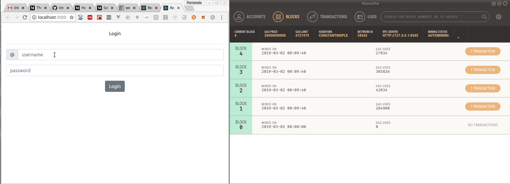

# Creando una aplicación React para interactuar con la billetera virtual

## Cómo conectar nuestro smart contract

En la consola Truffle escribimos

```js
JSON.stringify(Wallet.abi) // abi => Application Binary Interface
```

El output será importante en breve.

## Aplicación React

La creamos mediante CRA (create-react-app), con los siguientes componentes

* router de React
* Redux store
* Reactstrap o componentes React de Bootstrap
* y la biblioteca web3, que nos permite conectarnos al nodo Ethereum

Pueden ver el archivo `package.json` para más información.

## Definiendo el setup

Crearemos un archivo setup, donde tomaremos la configuración según el archivo `truffle-config.js`:

```js
import Web3 from 'web3'

const web3 = new Web3(new Web3.providers.HttpProvider("http://localhost:8545"))
    // hay que usar el puerto y host que tiene truffle-config.js
let walletABI = ... 
    // copiar el output de la consola truffle cuando se ejecutó el comando
    // JSON.stringify(Wallet.abi)
    // ojo si crean funciones adicionales, deben volver a ejecutar el comando JSON.stringify(Wallet.abi)
    // y copiarlo nuevamente porque no estarán publicadas las funciones

...
let walletAddress = ...
    // la cuenta o valor que sale del contract address una vez deployado en la EVM como Ganache
    // como veremos a continuación

web3.eth.defaultAccount = web3.eth.accounts[0]

const walletContract = web3
    .eth
    .contract(walletABI)
    .at(walletAddress)
export {walletContract}
```


## Repaso de tareas previas a levantar la app

Cuando levantemos una instancia de Ganache, en nuestro caso en el puerto 8545, tenemos que

* como en este caso agregamos una función para recuperar el saldo de una _address_, debemos primero compilar el smart contract con `truffle compile` y recuperar el nuevo `abi` (o de lo contrario el componente web3 no encontrará las funciones nuevas que acabamos de crear)
* deployar los smart contracts en la EVM con `truffle migrate --reset`
* modificar en el archivo `setup.js` la variable `walletAddress` con el address del Smart Contract, para sincronizar nuestro `Wallet.sol` con la aplicación React
* reiniciar la aplicación con `npm start`


## Demo de la app



## Cómo funciona el login


Internamente el login maneja como estado usuario y password (tiene un binding bidireccional de ambos campos), además de mostrar mensajes de error con un componente custom. Al hacer click sobre el botón "Login" se dispara un método interno que

* busca la cuenta asociada al username ingresado por el usuario
* con el objeto cuenta encontrado, hace la consulta por _address_ a la billetera mediante una llamada al objeto _walletContract_ generado por web3 que como resultado nos devolverá el _balance_ (saldo) de la cuenta
* esto dispara la acción **sync_account** que le asigna la cuenta (con el saldo actual) al _store_ de Redux
* por último utilizamos el router de React para llevarnos a `/wallet`

Por motivos didácticos simplificamos el login, donde ni siquiera hay validación de contraseña.

## Formulario que muestra la billetera

## Otros tutoriales

* [Ratings de peliculas](https://medium.com/@takleakshar/how-to-build-a-decentralized-full-stack-app-in-ethereum-and-react-42e63d45a208)
* [Aplicaciones React descentralizadas](http://reactdapps.com/)
