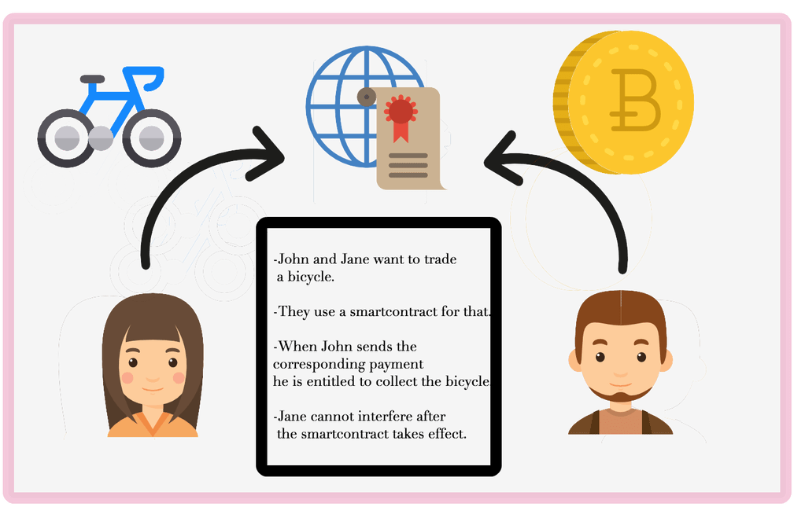

# Introducción a Smart Contract

Un contrato legal se libra entre dos partes, donde la mayoría de las veces es necesario un tercero como garante de ese acuerdo: escribanos, bancos, inmobiliarias y muchas más entidades se encargan día a día de esta tarea. 

Un _smart contract_ comparte las características de un contrato: se libra entre dos partes, pero para descentralizar a esa tercera parte quien lo reemplaza es un algoritmo. Entonces un _smart contract_ tiene información propia de ese contrato pero además cálculos que permiten verificar que ese contrato se cumpla.

Algunos ejemplos:

- una billetera virtual, que no permite transferir más fondos de lo que tiene la cuenta
- en un sistema de votación, un voto se representa con un _smart contract_ que impide votar a una persona incapacitada, o que sufrague dos veces a una persona que ya emitió su voto

# Cómo sigo

Podés

* [Volver a la página central](../README.md)